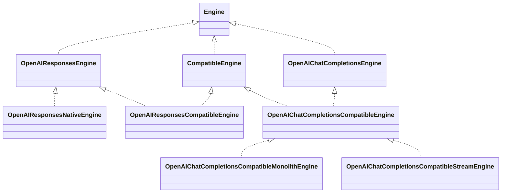

## Architecture Diagram

```mermaid
classDiagram

OpenAIResponsesEngine <|.. OpenAIResponsesNativeEngine

CompatibleEngine <|.. OpenAIResponsesCompatibleEngine
OpenAIResponsesEngine <|.. OpenAIResponsesCompatibleEngine
Engine <|.. OpenAIResponsesEngine

Engine <|.. CompatibleEngine

Engine <|.. OpenAIChatCompletionsEngine
OpenAIChatCompletionsEngine <|.. OpenAIChatCompletionsCompatibleEngine
CompatibleEngine <|.. OpenAIChatCompletionsCompatibleEngine
OpenAIChatCompletionsCompatibleEngine <|.. OpenAIChatCompletionsCompatibleMonolithEngine
OpenAIChatCompletionsCompatibleEngine <|.. OpenAIChatCompletionsCompatibleStreamEngine
```

## 继承

用组合代替继承以实现多重继承的效果。
